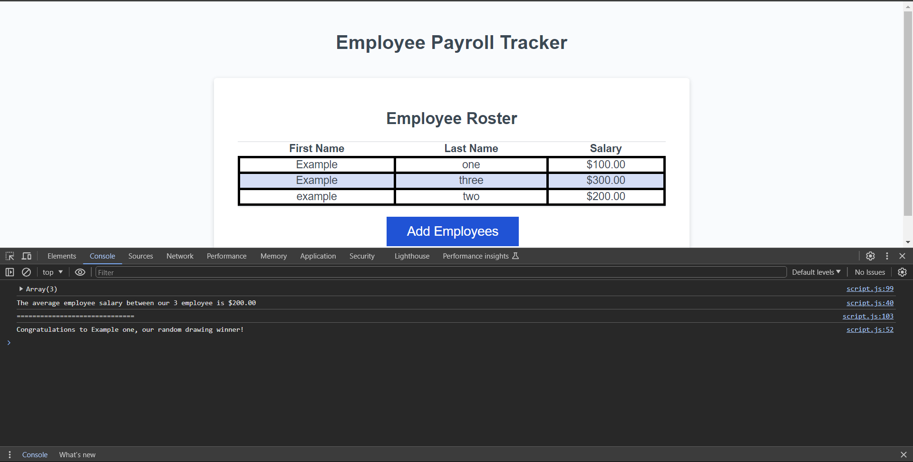

# Homework-3

https://xoel-m.github.io/Homework-3-js-challenge/

In this project I had to add code to have inputed values stored into an array, display the average salary of all within the array, and a code that selects a random index from the array with a congratulating message. By doing so I get a better understainding what javascript can do.